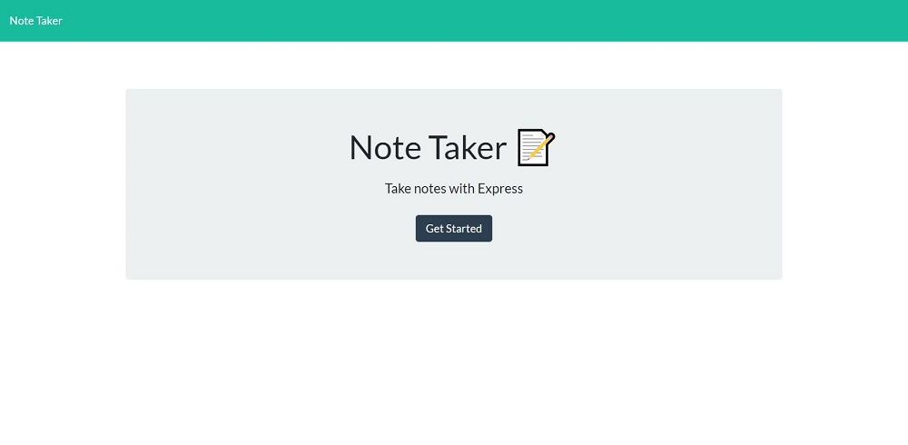
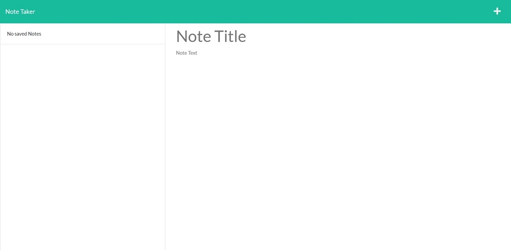
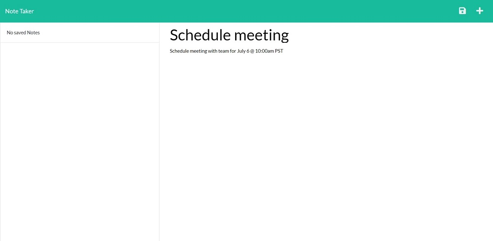
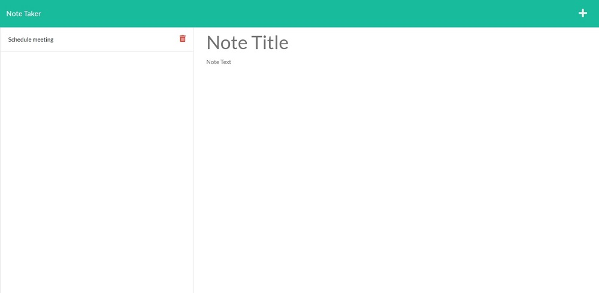
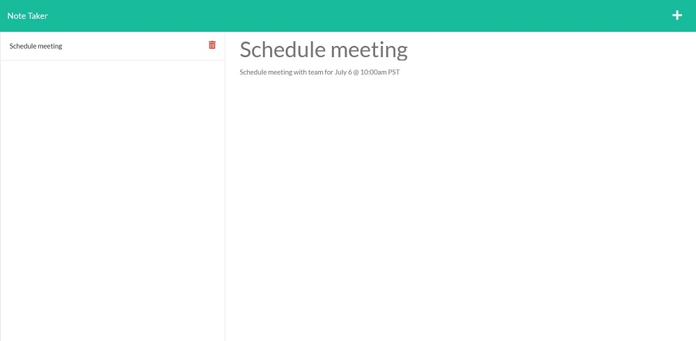

# Note Taker

## Description

This application will allow you to write notes and save them. After entering your note you can save it for future reference by clicking on the floppy disk icon in the upper right corner. By utilizing the Express for NodeJS, the notes will be saved if you were to refresh or leave the web page. After a note is saved, you can open the note with its details by clicking on the note itself. When you no longer need a note, you can delete it by clicking on the trash can icon to the right of the note.

## Table of Contents

- [Installation](#installation)
- [Usage](#usage)
- [Contributing](#contributing)
- [Testing](#testing)
- [License](#license)
- [Resources](#resources)

## Installation

To run the express dependency, you will need to type the command "npm i express". In order to give each note their own id, you will need to input the command " npm i nanoid".

## Usage

The app is deployed through Heroku, and can be found at https://note-taker0630.herokuapp.com/.

## Contributing

If you are looking to contribute to the project, you can fork the repo from its GitHub page.

You can find the project at https://github.com/JMan4342/NoteTaker.

## Testing

Below you will find screenshots and a link to a video showing the application in action.

https://drive.google.com/file/d/1R0Y1ejBUYyk_WQ85859OkvHSG-UGdp5M/view?usp=sharing

## License

MIT

## Resources

I utilized the following sites to assist in creating my weather dashboard app.

- https://www.w3schools.com/
- http://expressjs.com
- https://npmjs.com
- https://www.javascripttutorial.net

## Questions

If you have any questions, I can be reached on my GitHub at [JMan4342](https://github.com/JMan4342).

You can also reach me by email at manning.joseph.4342@gmail.com.
